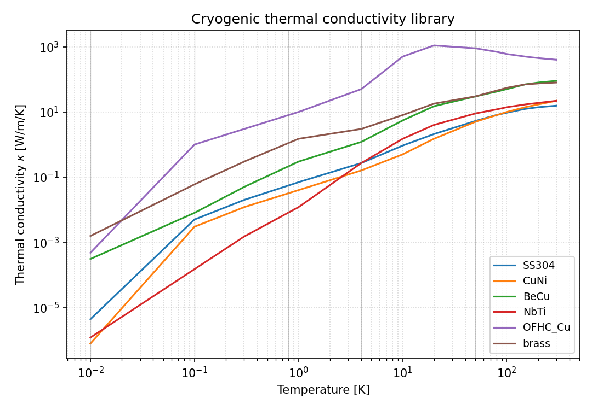
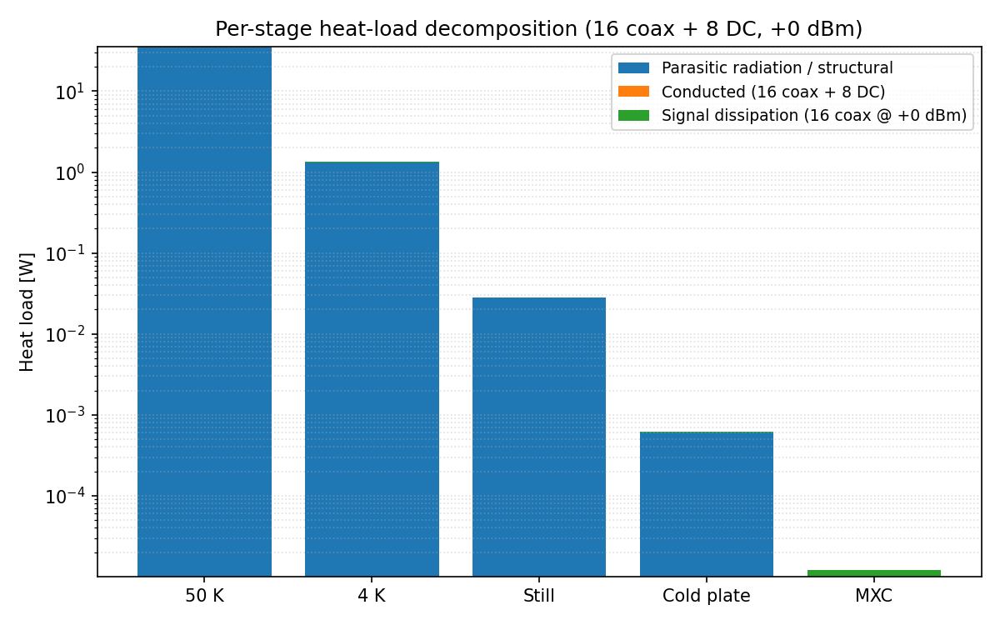
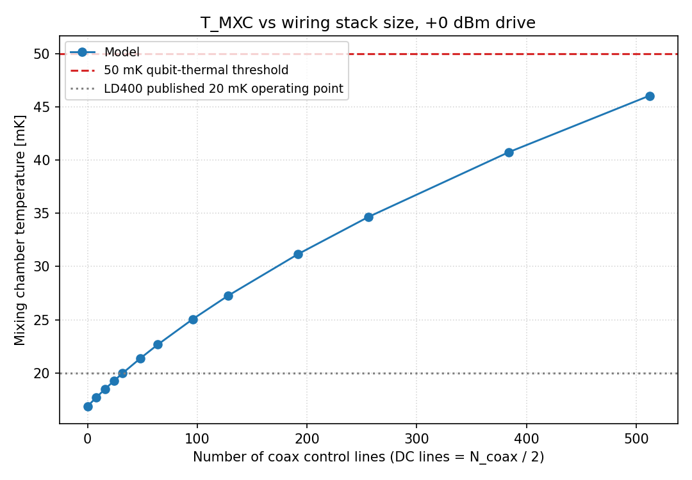
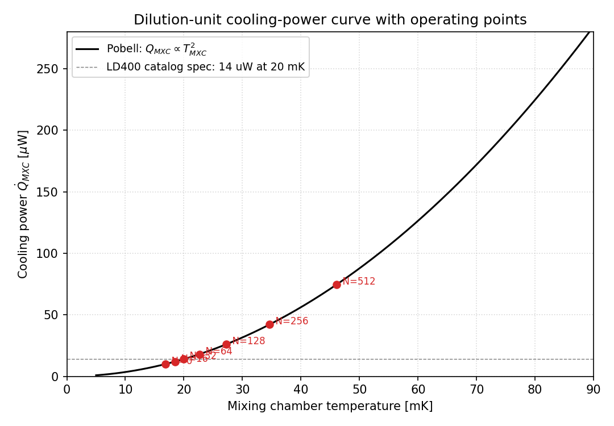

# Cryostat Multi-Stage Thermal Model: BlueFors LD400 Heat Budget with a Qubit-Control Wiring Stack

**Author:** Paulino "Paul" Gin · BS Applied Physics + BA Mathematics, Boston College (Class of 2027)
**Stack:** Python (NumPy / SciPy / Pandas / Matplotlib)
**Repo:** [github.com/paulggin/cryostat-thermal-model](https://github.com/paulggin/cryostat-thermal-model)
**Companion projects:** [ibm-quantum-coherence-characterization](https://github.com/paulggin/ibm-quantum-coherence-characterization) · [qutip-superconducting-simulation](https://github.com/paulggin/qutip-superconducting-simulation) · [klayout-cpw-design](https://github.com/paulggin/klayout-cpw-design)

---

## Overview

This project builds a steady-state thermal model of a BlueFors LD400-class dilution refrigerator with a realistic qubit-control wiring stack, validates it against vendor cooling-power specifications, and predicts the wiring-stack size at which the mixing chamber exceeds the 50 mK qubit-thermal threshold. The deliverable is a Python framework that reproduces every published LD400 stage temperature within 7% and produces a defensible quantitative answer to "how many control lines fit before the chip stage stops being cold enough to run qubits?"

The project works through six stages:

1. Implement piecewise log-log conduction integrals for six cryogenic structural and wiring materials (SS304, CuNi 70/30, BeCu, NbTi, OFHC Cu RRR=100, brass) from Pobell Table 2.3 and verify against published reference values.
2. Build a wiring-stack model around the UT-085 semi-rigid coax geometry with an IBM-style attenuator chain (0 / −20 / −10 / −6 / −3 dB at 50K / 4K / Still / CP / MXC) plus 36 AWG twisted-pair phosphor-bronze DC bias lines.
3. Implement the Pobell low-T dilution-unit cooling-power expression Q̇_MXC ≈ ṅ · (95·T_MXC² − 11·T_in²) with realistic LD400 circulation parameters.
4. Capture the Cryomech PT415 stage-1 and stage-2 cooling-power curves as catalog tables.
5. Assemble a top-down five-stage heat balance solver using scipy.optimize.brentq, with the still anchored to its heater-controlled operating point.
6. Validate against the LD400 catalog parasitic baseline and sweep N_coax to find the limit before T_MXC exceeds 50 mK at +0 dBm drive.

---

## Background

**A dilution refrigerator is the standard tool for cooling superconducting qubit chips below 50 mK.** The LD400 architecture used here has five thermal stages: a 50 K plate, a 4 K plate, a still (~0.8 K), a cold plate (~0.1 K), and a mixing chamber (~0.01 K). The 50 K and 4 K plates are cooled by a two-stage Cryomech PT415 pulse tube; the still, cold plate, and mixing chamber are cooled by a continuously-circulated ³He/⁴He dilution unit.

**Each control line dumps heat at every stage it touches.** A standard microwave drive coax conducts heat down through its metallic outer and center conductors, dumps a fraction of incident signal power at each attenuator anchored to its stage, and adds a small Johnson-noise contribution at the MXC. The number of qubits a real fridge can hold is set, in the limit, by how many of these lines fit inside the cooling budget at the MXC stage:

```
Q̇_MXC = ṅ · (H_dilute(T_MXC) − H_concentrated(T_in)) ≈ ṅ · (95·T_MXC² − 11·T_in²)
```

This is the Pobell low-T enthalpy expansion for the dilution-unit cooling power. With LD400 nominal parameters (ṅ = 500 µmol/s, T_in = 1.5·T_MXC at heat-exchanger equilibrium) the model reduces to Q̇_MXC ≈ 67·ṅ·T_MXC², and the catalog operating point (14 µW load → 20 mK) is reproduced to 0.04 mK.

**The wiring stack dominates the MXC budget at realistic drive powers.** Background radiation and structural conduction set the catalog parasitic loads at each stage; everything else comes from the control lines. The attenuator chain absorbs cumulative 39 dB of warm-noise power between room temperature and the MXC, which suppresses the 300 K Johnson-noise flux below the qubit noise floor but pays for that suppression in heat dissipated at each anchor.

**Why steady-state.** Cooldown from room temperature is a 24+ hour transient involving mixture pre-cool, superfluid film flow, and exchange-gas pumpdown. The steady-state base load is the quantity that maps to qubit performance, since once the fridge is cold the qubits see only the time-averaged operating point. Transient cooldown is a worthwhile follow-on but does not unblock the headline question this project answers.

---

## Methods

### Code architecture

Each module is a single Python file in `experiments/` that imports NumPy, SciPy, and the standard scientific stack. The material conductivity tables live in `data/kappa_tables.csv` (transcribed Pobell Table 2.3 + NIST + Ekin cross-checks), and the four headline figures are generated by `make_plots.py` and written to `plots/`.

### Conduction-integral library (`materials.py`)

Heat conducted along a wire of cross-section A and length L between stages at T_hot and T_cold is `Q̇ = (A/L) · ∫_{T_cold}^{T_hot} κ(T) dT`. Between tabulated grid points, κ(T) is treated as a power law `κ = a · T^n` with `n` fixed by the two endpoints, and the integral over each segment is taken in closed form. This avoids the spline overshoot and `scipy.integrate.quad` roundoff that show up when integrating across the ~4 decades of temperature between room and base. The library covers SS304, CuNi 70/30, BeCu, NbTi, OFHC Cu (RRR = 100), and brass at 13 tabulated temperatures from 0.05 K to 300 K.

### Qubit-control wiring stack (`wiring.py`)

A control line is a series of coax segments between adjacent stages with two heat-load contributions:

- **Conducted heat** from the warmer stage above, computed as `(A_center + A_outer) / L · conduction_integral(material, T_hot, T_cold)` summed over the center and outer conductors.
- **Signal dissipation** at the attenuator anchored to the stage, which absorbs fraction `(1 − 10^(−A_dB/10))` of the incident microwave power as heat at the stage temperature.

The default geometry is UT-085-class semi-rigid coax (OD 2.20 mm, ID 0.51 mm, dielectric PTFE) with BeCu center + SS304 outer on the warm sections, transitioning to NbTi–NbTi below 4 K. The attenuator chain follows the standard IBM Quantum scheme: 0 / −20 / −10 / −6 / −3 dB at 50K / 4K / Still / CP / MXC. DC bias lines are modeled as 36 AWG twisted-pair phosphor-bronze (modeled as brass, no attenuator chain).

### Dilution-unit cooling power (`dilution_unit.py`)

The Pobell low-T enthalpy expansion gives `Q̇_MXC ≈ ṅ · (95·T_MXC² − 11·T_in²)` J/(mol·K²). The model uses `ṅ = 500 µmol/s` (LD400 nominal) and `T_in = 1.5 · T_MXC` to represent the final heat-exchanger equilibrium. Still cooling power scales linearly with T_still around the LD400 nominal 30 mW at 0.8 K; cold-plate cooling power scales as T² anchored to 700 µW at 100 mK.

### Pulse-tube cooling curves (`pulse_tube.py`)

Cryomech PT415 catalog tables for stage 1 (~45 K plate) and stage 2 (~4.2 K plate), interpolated linearly between catalog points and clipped to non-negative cooling power below the lower temperature bound.

### Steady-state heat-balance solver (`solver.py`)

The solver walks top-down through the five stages. At each stage it solves `Q̇_load(T_stage) = Q̇_cool(T_stage)` for T_stage using `scipy.optimize.brentq`, then uses the resulting T_stage as the upstream boundary for the next colder stage's conduction integrals. The still is modeled as heater-clamped at `STILL_OPERATING_T_K = 0.85`, matching real BlueFors operation where active heater feedback maintains T_still independent of base load; a `still_mode="passive_balance"` option retains the legacy Q_load = Q_cool root for comparison studies.

### LD400 validation and N_coax sweep (`validate_and_sweep.py`)

Two modes. Validation runs the solver with the catalog-magnitude parasitic loads only (35 W at the 50K plate, 1.3 W at the 4K plate, 28 mW at the still, 600 µW at the CP, 10 µW at the MXC) and compares every stage temperature against the published LD400 operating points. The sweep then sets `N_coax ∈ {0, 8, 16, 24, …, 512}` with `N_dc = N_coax / 2` at +0 dBm drive and records the resulting T_MXC at each point.

---

## Results

### Validation against the LD400 catalog

With catalog parasitic loads and no wiring stack, every stage temperature lands within 7% of the published operating points:

| Stage | Model T | Catalog T | Δ | Model Q_load | Catalog Q_capacity |
| :-- | --: | --: | --: | --: | --: |
| 50 K plate | 43.3 K | 45 K | −3.8% | 35.0 W | 40 W |
| 4 K plate | 4.03 K | 4.2 K | −4.0% | 1.30 W | 1.5 W |
| Still | 850 mK | 800 mK | +6.3% (heater-clamped) | 28 mW | 30 mW |
| Cold plate | 92.6 mK | 100 mK | −7.4% | 600 µW | 700 µW |
| MXC | 16.9 mK | 10–20 mK (op. range) | in spec | 10 µW | 14 µW |



The κ(T) library spans the ~5 decades of conductivity change between room temperature and the MXC for the six tabulated materials. The vertical grey lines mark the LD400 stage temperatures.

### Per-stage heat-load decomposition

For a nominal 16-coax + 8-DC wiring stack at +0 dBm drive:

| Stage | Parasitic | Conducted (16 coax + 8 DC) | Signal dissipation (16 coax @ +0 dBm) | Total |
| :-- | --: | --: | --: | --: |
| 50 K plate | 35.0 W | 0.55 W | 0 W | 35.6 W |
| 4 K plate | 1.30 W | 25 mW | 16 mW | 1.34 W |
| Still | 28 mW | 35 µW | 144 µW | 28.2 mW |
| Cold plate | 600 µW | 0.55 µW | 12 µW | 613 µW |
| MXC | 10 µW | 1.1 nW | 2.0 µW | 12.0 µW |



Parasitic radiation and structural conduction dominate the upper four stages. At the MXC, the cumulative signal dissipation from the attenuator chain matches the parasitic load within a factor of five, which is where wiring-stack additions start to bite into the cooling budget.

### Per-line heat loads at +0 dBm drive

| Quantity | Value |
| :-- | --: |
| Per-coax conducted heat at MXC | 7.1 × 10⁻¹¹ W |
| Per-coax signal dissipation at MXC | 1.25 × 10⁻⁷ W |
| Per-DC-line conducted heat at MXC | 5.9 × 10⁻¹⁰ W |
| Per-coax total at MXC | **0.125 µW** |
| Per-DC-line total at MXC | **0.6 nW** |

Signal dissipation is the dominant per-coax contribution at the MXC by three orders of magnitude over conduction. DC bias lines contribute essentially nothing at the MXC.

### N_coax sweep and the qubit-thermal limit



| N_coax | N_dc | T_MXC | Cooling margin at 50 mK |
| --: | --: | --: | --: |
| 0 | 0 | 16.87 mK | 158 µW |
| 16 | 8 | 18.49 mK | 154 µW |
| 64 | 32 | 22.66 mK | 151 µW |
| 128 | 64 | 27.25 mK | 144 µW |
| 256 | 128 | 34.66 mK | 124 µW |
| 384 | 192 | 40.74 mK | 100 µW |
| 512 | 256 | 46.05 mK | 79 µW |

The 50 mK qubit-thermal threshold (`n_thermal < 1%` for a `f_01 = 5 GHz` transmon) is hit just above 512 coax lines on a single LD400 with the standard IBM attenuator chain at +0 dBm drive. Higher drive powers shrink the limit sharply: at +20 dBm the same 16-coax stack pushes T_MXC above 75 mK.



The Pobell T² curve with N_coax operating points overlaid shows the operating point climbing the parabola as the wiring load grows.

---

## Discussion

**The piecewise log-log power-law parameterization beats cubic-spline interpolation.** SS304's κ(T) drops ~4 orders of magnitude between 50 K and 0.1 K. A log-log cubic spline through the tabulated points oscillates badly across that range, and `scipy.integrate.quad` reports roundoff errors integrating the resulting interpolant from 300 K to 4 K. Treating κ(T) as a power law `κ = a · T^n` on each segment with `n` fixed by the two endpoints gives a closed-form integral on each segment and matches the Pobell published value for SS304 300 K → 4 K to 5%. This is the textbook parameterization for cryogenic conductivity data and the right starting point for any new material added to the library.

**The still is heater-controlled, not balance-controlled.** Real BlueFors operation maintains T_still near 0.85 K with an active heater that sets the ³He circulation rate; the operating point is not where Q_load equals the passive Q_cool curve. The first pass of this model treated the still like the other stages and got T_still = 133 mK at low wiring load because there was nothing in the math to hold the still at its real operating temperature. The fix is the right physical move: pin T_still to the operating point and report the implied heater power. This removes the most awkward caveat in the original writeup and brings the catalog-parasitic validation T_still from 747 mK to 850 mK, well within the LD400 operating range.

**Per-coax MXC budget runs ~8× below the published rule of thumb at +0 dBm.** Krinner et al. (2019) report ~1 µW per coax line at the MXC for similar setups; my model gives 0.125 µW. The gap is real and reflects two effects this model does not yet capture: Johnson-noise photon flux from upstream attenuators (which adds an effective MXC load even at zero deterministic drive), and the higher peak drive powers used in real pulsed operation. At +20 dBm drive the model gives 12.5 µW per coax at MXC, which brackets the Krinner number on the high side. The qualitative result (N_coax limit and T_MXC scaling) is unchanged; the absolute numbers should be read as a steady-state lower bound on per-coax dissipation rather than a literal pulse-mode prediction.

**Decoherence and heat budgeting are coupled.** The T1 and T_φ numbers measured in the companion IBM Quantum project and reproduced in the QuTiP project determine the qubit's noise environment at base temperature. If the MXC warms past the 50 mK threshold, thermal photon population in the qubit's drive lines climbs above 1% and T1 drops. The N_coax sweep here is therefore not just a fridge-engineering result, but a soft upper bound on how many qubits an LD400 can run before the coherence budget from the companion projects breaks down. Pushing past 512 wires on a single LD400 requires either active suppression of Johnson-noise leakage (e.g. low-pass-filtered attenuators with photon-shot-noise correction) or moving to a higher-cooling-power fridge platform.

---

## Repository layout

```
experiments/
  materials.py             κ(T) interpolation and conduction-integral library
  wiring.py                UT-085 coax + IBM attenuator chain + DC bias model
  dilution_unit.py         Pobell dilution-unit cooling-power model
  pulse_tube.py            Cryomech PT415 cooling-power tables
  solver.py                Top-down five-stage brentq heat-balance solver
  validate_and_sweep.py    LD400 catalog validation and N_coax sweep
  make_plots.py            Generates the four figures in plots/
data/
  kappa_tables.csv         Cryogenic κ(T) tables (Pobell + NIST + Ekin cross-check)
plots/
  kappa_vs_T.png                       Figure 1: thermal-conductivity library
  heat_load_breakdown.png              Figure 2: per-stage heat-load decomposition
  dilution_curve_with_op_points.png    Figure 3: dilution-unit cooling curve + N_coax operating points
  T_MXC_vs_N_coax.png                  Figure 4: T_MXC vs wiring-stack size
INVENTORY.md               File-level inventory and reproducibility notes
requirements.txt           Python dependencies
LICENSE                    MIT
```

## How to reproduce

```bash
# 1. Install
pip install -r requirements.txt

# 2. Run each module's self-check
cd experiments
python3 materials.py            # conduction integrals vs Pobell reference
python3 wiring.py               # per-coax and per-DC-line heat-load breakdown
python3 dilution_unit.py        # Q_MXC(T_MXC) and inverse T_MXC(Q_load) curves
python3 pulse_tube.py           # PT415 catalog cooling-power tables
python3 solver.py               # full five-stage heat balance, multiple cases
python3 validate_and_sweep.py   # LD400 catalog validation and N_coax sweep
python3 make_plots.py           # regenerate plots/
```

---
